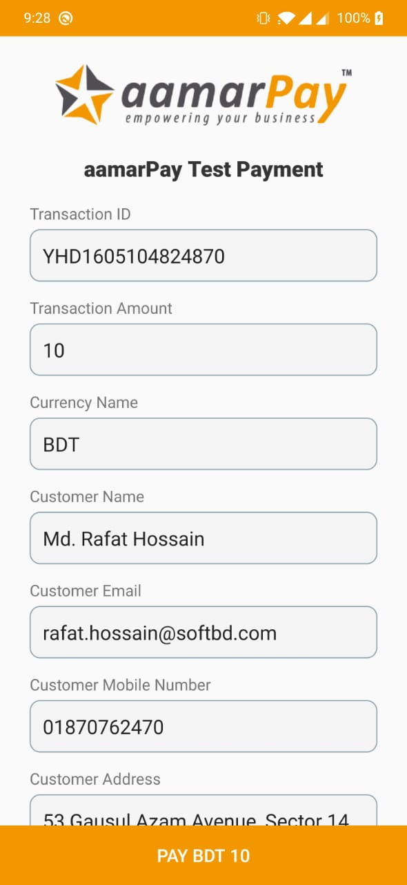
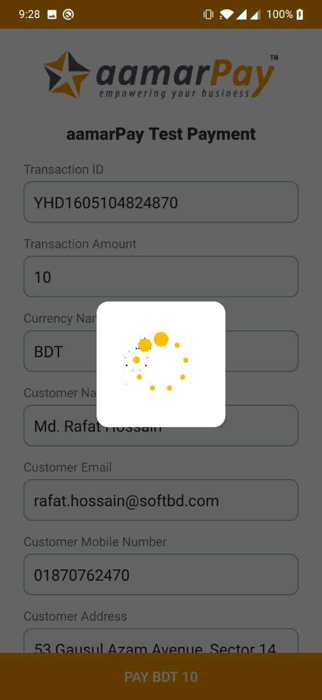
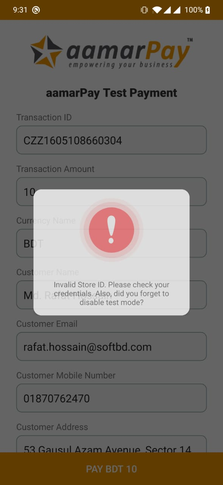

# aamarPay Android Library
[](https://jitpack.io/#rafathossain96/aamarPay-Android-Library)
[](https://android-arsenal.com/api?level=16)

An Android library for integrating aamarpay payment gateway. For more details visit www.aamarpay.com

<p align="center">
  
  
  
  
  
</p>

## Sample Code
You can find the sample code here: [Sample Code](https://github.com/rafathossain96/aamarPay-Payment-Gateway-Android-Sample)

## Installation
Add the JitPack repository to your build file. Add it in your root `build.gradle` at the end of repositories:
```
allprojects {
  repositories {
    ...
    maven { url 'https://jitpack.io' }
  }
}
```

Add the following line to your `android` section of your build script:
```
compileOptions {
  sourceCompatibility JavaVersion.VERSION_1_8
  targetCompatibility JavaVersion.VERSION_1_8
}
```

Add the following line to your `dependencies` section of your build script:
```
dependencies {
  implementation 'com.github.rafathossain96:aamarPay-Android-Library:1.0'
}
```

## Permission
Add this permission into your `AndroidManifest.xml` file
```
<uses-permission android:name="android.permission.INTERNET"/>
```

## Usage
aamarPay android library includes aamarPay payment gateway and custom dialog builder. First you need to create the instance of aamarPay Payment Gateway with store id and signature key.
```
AamarPay aamarPay = new AamarPay(this, STORE_ID, SIGNATURE_KEY);
```
To use the library in sandbox mode, you need to set `testMode(Boolean)` to true.<br><b>If you make it false, gateway will be inititalized in Live Mode</b>
```
aamarPay.testMode(true);
```
<b>For testing purposer, you need to provide SANDBOX store id and signature key. For live mode you need to provide the store id and signature key provided by your KAM (Key Account Manager).</b>
<br><br>If you want the to auto generate the transaction id, you can set the parameter `aamarPay.autoGenerateTransactionID(Boolean)` to true. Then the transaction id will be generated by aamarPay.
```
aamarPay.autoGenerateTransactionID(true);
```
If you set the `autoGenerateTransactionID(false)` then you need to set the transaction ID manually by `setTransactionID(String)`
```
aamarPay.setTransactionID("TRXUHDU");
```
You can also get an unique transaction id by calling `generate_trx_id()` and then you can pass it to `setTransactionID(String)`
```
aamarPay.generate_trx_id()
```
This will return an unique id every time.

Next step is to set the transaction parameter and customer details.
Call `setTransactionParameter(String, String, String)` to set the transaction parameter.
```
aamarPay.setTransactionParameter("Transaction Amount", "Transaction Currency", "Payment Description");
```
Call `setCustomerDetails(String, String, String, String, String, String)` to set the customer details.
```
aamarPay.setCustomerDetails("Customer Name", "Customer Email", "Customer Phone", "Customer Address", "Customer City", "Customer Country");
```
After setting up all the required parameter, you need to call `initPGW(Listener)`
```
aamarPay.initPGW(new AamarPay.onInitListener() {
  @Override
  public void onInitFailure(Boolean error, String message) {
    // You will get the response, if payment gateway initialization is failed.
  }

  @Override
  public void onPaymentSuccess(JSONObject jsonObject) {
    // You will get the payment success response as a JSON callback
  }
  
  @Override
  public void onPaymentFailure(JSONObject jsonObject) {
    // You will get the payment failed response as a JSON callback
  }
  
  @Override
  public void onPaymentProcessingFailed(JSONObject jsonObject) {
    // You will get the payment processing failed response as a JSON callback
  }

  @Override
  public void onPaymentCancel(JSONObject jsonObject) {
    // You will get the payment cancel response as a JSON callback
  }
});
```
To access the data from jsonobject, you can call the following method
```
try {
  jsonObject.getString("trx_id");
} catch (JSONException e) {
  e.printStackTrace();
}
```
If somehow you miss the JSON Response, then you can call the transaction verification API to get the transaction data. You need to pass the trx id with the method.
```
aamarPay.getTransactionInfo("TRANSACTION_ID", new AamarPay.TransactionInfoListener() {
  @Override
  public void onSuccess(JSONObject jsonObject) {
    // You will get the json response here.
  }

  @Override
  public void onFailure(Boolean error, String message) {
    // You will get the error message here, if request fails.
  }
});
```

### Mandatory Steps
1. Create Instance of aamarPay.
2. Set the test mode option.
3. Set the transaction id preference.
4. Set the transaction parameter.
5. Set the customer details.
6. Init PGW.

### Dialog Builder
You can use the dialog builder to generate loading or error message popup as below.

<p>
  
  
</p>

To use this, create an instance first, then call the popup as required.
```
AlertDialog alertDialog;
DialogBuilder dialogBuilder = new DialogBuilder(this, alertDialog);

// Show loading
dialogBuilder.showLoading();

// Error popup
dialogBuilder.errorPopUp("Error Message");

// To dismiss popup
dialogBuilder.dismissDialog();
```

## Support
If you need any kind of integration support, please email at integration@aamarpay.com. If you want to take payment gateway, you can send your queries at support@aamarpay.com
